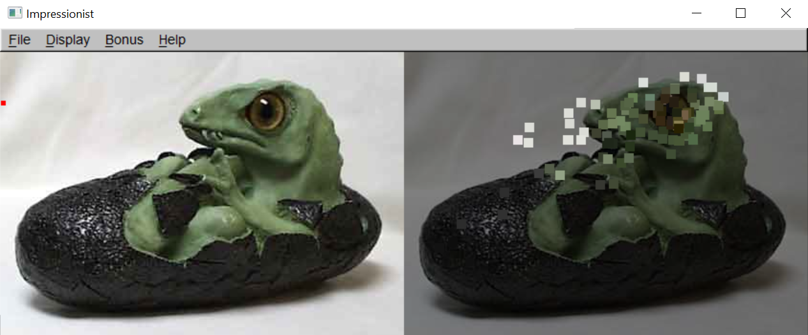
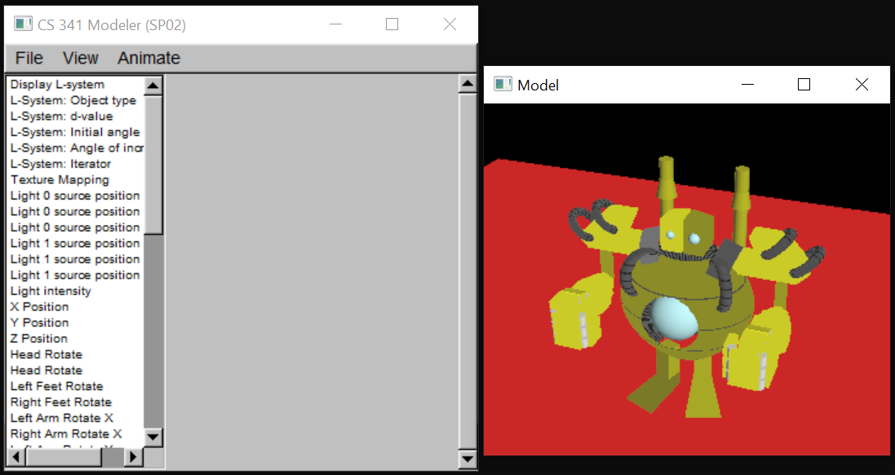
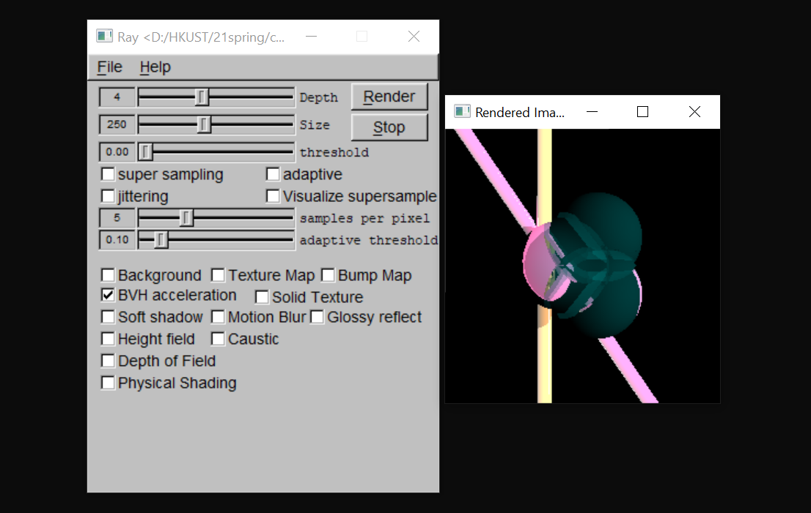
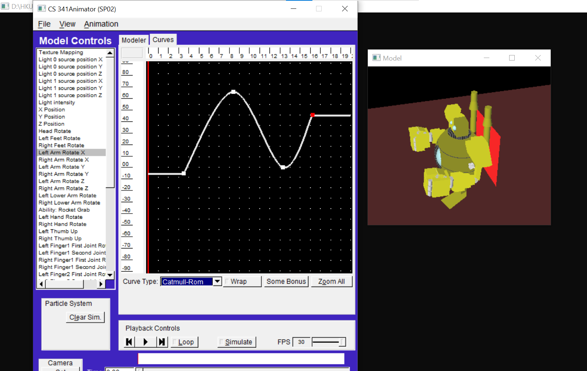

# COMP4411-course-project
The course projects of COMP4411 in Spring 2021. 
The course refers to [CS457](https://courses.cs.washington.edu/courses/cse457/21au/) of University of Washington. The contents of the project are basically the same.
However, we still use FLTK to design our UI.

You can use Visual Studio to open one of them and run. The `.exe` file will be in `Debug` folder.

Since the key point of those projects is to implement those computer graphic algorithms, we do not handle many unexpected errors.

## project 1: 

https://github.com/LIANG-SN/Impressionist

A 2D painting project. 

This kind of sample brushes are extended to videos.  

Instead of Bayse Matting, we implement a KNN Matting(https://repository.ust.hk/ir/bitstream/1783.1-55952/1/KNN_Matting_CVPR2012.pdf)

## project 2: 

https://github.com/LIANG-SN/Modeler

A 3D model project.

You can edit the pose of the model from the bar on the left.

It also includes a L-system, meta-ball and inverse kinematics.

## project 3: 

https://github.com/LIANG-SN/Trace

A 3D lighting project.

The main contents are texture methods, ray tracing(lighting, shading, etc.).

It also includes CSG, caustics etc.

## project 4: 

https://github.com/lyclyc52/Animator

Particle system and curving project.

 We did no implement quite a lot B&W due to time limitation.

